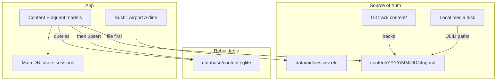

# Flat-File Content Storage — Design Spec

**Date:** 2026-07-12  
**Status:** Working agreement (architecture may still evolve)  
**Branch:** `feature/flat-file-content`

## Context

Local-only for now — no production. Architecture is still being shaped. We need a **one-time migration** from the current DB (+ incomplete CSVs) into the new file layout, not an ongoing production cutover.

## Goal

Make lifelog data durable, portable, and git-trackable: **files are the source of truth**, a **SQLite index** is the rebuildable query layer (Stache idea, real SQL), and Eloquent keeps feeling like Eloquent (Orbit idea, custom driver — not the Orbit package).

## Root cause this fixes

`migrate:fresh` wiped the local DB. CSVs only held a subset; the DB had extra rows from syncs and authored content that never mirrored back to files — that gap is what was lost. Going forward, **every durable write must land in a file** (`content/` or a Sushi source). The SQLite index is disposable.

## Architecture



| Layer | Role | Durable? |
|-------|------|----------|
| `content/Y/M/D/slug.md` | Source of truth, human browse, git | Yes |
| `database/content.sqlite` | Query index (timeline spine, filters, aggregates) | No — rebuildable |
| Sushi + `data/airlines.csv` etc. | Reference lookups only | Yes (CSV/array source) |
| Main DB | Users, sessions, queues, non-lifelog | Yes |
| Media disk | Image bytes at `media/{ulid}/…` | Yes (separate from git) |

### Decisions locked

- **Custom Orbit-style driver** — not stock Orbit/Paper/Statamic. Date-path layout we control.
- **Hand-rolled model↔file mapping** — `HasFlatFile`, `ContentPath`, `EntryFileRepository`, `EntryFileImporter`. Libraries cover parse/dump only (`spatie/yaml-front-matter` + Symfony Yaml); no third-party Eloquent flat-file driver.
- **File first, then upsert SQLite** on `save()` / `delete()`.
- **Dedicated content SQLite** for all timeline/content models + spine + tags + attachments index (so morphs stay on one connection).
- **Incremental index updates** day-to-day; `content:cache:clear` / `content:cache:warm` only for bootstrap/disaster.
- **Git tracks `content/`**; batched commits when convenient (no deploy pipeline yet).
- **Sushi** for airlines/airports (and similar lookups) — not for timeline types.
- **No DB-only syncs** — Strava/Trakt/Rovi/Foursquare must go through the same file-first save path.

## File layout + identity

**Path:** `content/{YYYY}/{MM}/{DD}/{slug}.md`  
Example: `content/2026/07/12/morning-walk.md`

- **ULID in frontmatter** (`id`) — stable PK for cache, relationships, media folders, rebuild upserts.
- **Filename = URL slug** — human-facing; may rename without breaking identity.
- **Date folder** from `occurred_at`; changing the date **moves** the file.
- **Slug rules** match the site: one-per-day types use the type name (`food.md`, `sleep.md`); multi-per-day use descriptive slugs with stable numeric suffixes (`morning-walk-2.md`) assigned once, never renumbered.
- **Articles:** Portable Text does not round-trip as markdown body — use `.json` (or structured content in a format that preserves PT).
- **Daily aggregates** (food): one file per day with items as an array — not one file per item.
- **Media:** bytes on `MEDIA_DISK` at `media/{entry-ulid}/photo-1.jpg`; frontmatter lists relative names only (`photos: [photo-1.jpg]`). Not in git.
- **Out of the date tree:** reference dumps for Sushi; users on main DB.

### Frontmatter shape (illustrative)

```yaml
---
id: 01JABCDEF...
type: activity
occurred_at: 2026-07-12T07:30:00+01:00
timezone: Europe/London
slug: morning-walk
photos: [photo-1.jpg]
source: strava
source_id: "12345"
# type-specific fields...
---
Body when needed
```

## Driver behaviour

- Trait on content models (e.g. `HasFlatFile`).
- Connection: `content` → `database/content.sqlite` (gitignored).
- PK: ULID string, non-incrementing.
- `save()`: ensure ULID/slug → write/move file → upsert SQLite row → existing spine/calorie observers (on content connection).
- `delete()`: delete file → delete cache row (+ spine via observers).
- Reads: Eloquent against content SQLite only — no filesystem on the request path.
- Commands: `content:cache:clear`, `content:cache:warm`, `content:sync {path}`; optional later `content:commit` for batched git.

## One-time local migration

Single script/command that:

1. Uses the backed-up / current `database.sqlite` as the richest source.
2. Fills gaps from CSVs only where the DB is empty/missing.
3. Emits `content/Y/M/D/slug.*` with new ULIDs and builds `content.sqlite`.
4. Retires timeline CSVs as source of truth (keep airlines/airports CSV for Sushi).

No dual-running environments — just move local onto the new system safely.

## Phasing

1. Backup current `database.sqlite` + branch `feature/flat-file-content` (**done**).
2. Keep this spec updated as decisions firm up.
3. Core driver + authored/timeline pilots — **landed for**:
   - **notes**, **articles** (`.json` + Portable Text), **projects**, **pages** (`content/pages/{slug}.json`)
   - **checkins**, **flights**, **fuel** (shared `UrlSlugAllocator` keeps same-day `fuel` / venue collisions as `fuel-2`, etc.)
   - `ulid` columns retained alongside integer PKs for morphs during pilot
   - Commands: `content:export`, `content:sync`, `content:cache:warm`, `content:cache:clear`
   - `content` SQLite connection configured for later cutover; models still use the default DB as index
4. Remaining timeline types — **activity, sleep, calorie (day aggregate), podcast, media** landed on this branch; series skipped until a model exists. Sync commands (Strava/Trakt/etc.) still need file-first hardening.
5. **Sushi lookups** — `Airline` / `Airport` read `data/airlines.csv` + `data/airports.csv` (cached outside testing); DB tables dropped. Edit the CSVs to change reference data.
6. **ULID media paths** — `UlidPathGenerator` stores files at `media/{entry-ulid}/…` on `MEDIA_DISK`; flat-file frontmatter lists `photos: [cover.jpg, photo-1.jpg]` (cover + gallery only). Relocate existing files with `media:relocate-ulid`.
7. **Content SQLite index (bench)** — `content:cache:warm` rebuilds `database/content.sqlite` from the tree (live app still on default DB). Table shapes come from each model's Orbit-style `schema(Blueprint)` via `DefinesContentSchema`. Time it with `content:bench`. Full model cutover onto `content` comes next.
8. Later: batched `content:commit` helper if useful.

## Out of scope (for now)

- Production deploy / zero-downtime cutover.
- Installing Orbit or Statamic.
- Long-running local file watcher (app writes update the index in-process).
- Image bytes in git.

## Backup note

Local DB backup before this work:

`storage/backups/database-20260712-192550.sqlite` (gitignored via `/storage/backups`).
